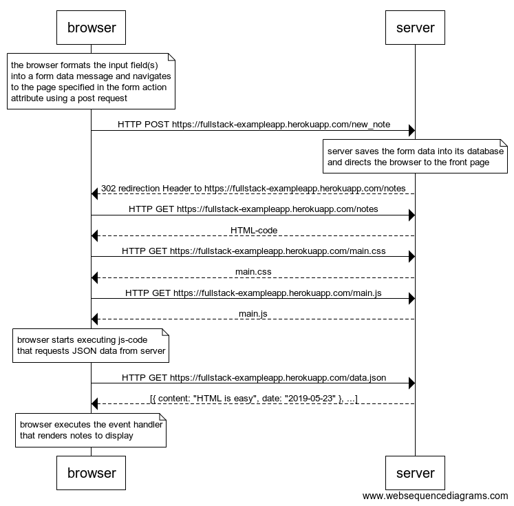

```
note over browser:
the browser formats the input field(s) 
into a form data message and navigates 
to the page specified in the form action 
attribute using a post request
end note

browser->server: HTTP POST https://fullstack-exampleapp.herokuapp.com/new_note

note over server:
server saves the form data into its database
and directs the browser to the front page
end note

server-->browser: 302 redirection Header to https://fullstack-exampleapp.herokuapp.com/notes

browser->server: HTTP GET https://fullstack-exampleapp.herokuapp.com/notes
server-->browser: HTML-code
browser->server: HTTP GET https://fullstack-exampleapp.herokuapp.com/main.css
server-->browser: main.css
browser->server: HTTP GET https://fullstack-exampleapp.herokuapp.com/main.js
server-->browser: main.js

note over browser:
browser starts executing js-code
that requests JSON data from server 
end note

browser->server: HTTP GET https://fullstack-exampleapp.herokuapp.com/data.json
server-->browser: {"message":"note created"}

note over browser:
browser executes the event handler
that renders notes to display
end note
```