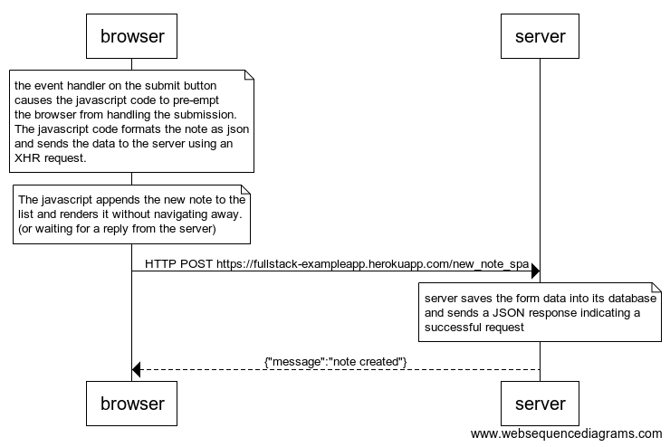

```
note over browser:
the event handler on the submit button 
causes the javascript code to pre-empt
the browser from handling the submission.
The javascript code formats the note as json
and sends the data to the server using an 
XHR request.
end note
note over browser:
The javascript appends the new note to the
list and renders it without navigating away.
(or waiting for a reply from the server)
end note

browser->server: HTTP POST https://fullstack-exampleapp.herokuapp.com/new_note_spa

note over server:
server saves the form data into its database
and sends a JSON response indicating a 
successful request
end note
server-->browser: {"message":"note created"}
```